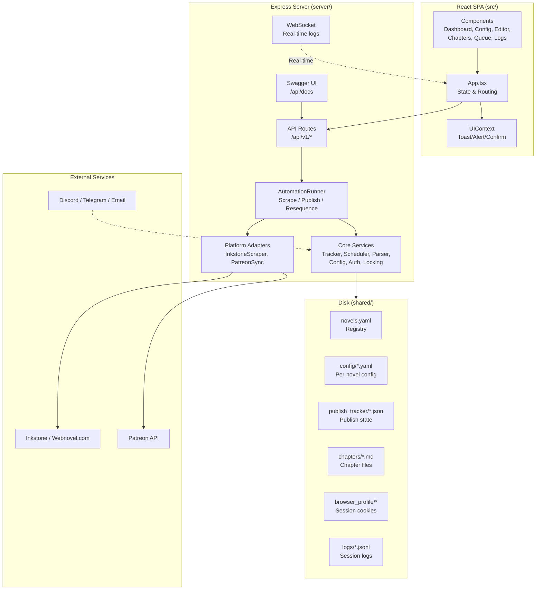

# UpWeb

Desktop app for webnovel authors to manage and automate publishing across Inkstone (Webnovel.com) and Patreon.

## Features

- **Multi-platform publishing** — scrape and publish chapters to Inkstone (Webnovel.com) and Patreon simultaneously
- **Chapter management** — create, edit, delete, lock/unlock local chapter drafts
- **Sequence audit** — detect missing chapters, duplicates, date mismatches across platforms
- **Scheduling** — preview and adjust publish schedules before execution
- **Browser automation** — headless Chromium via Playwright for platform interaction
- **Dry-run mode** — preview publish plans without making changes
- **Dashboard** — cross-novel overview of lead buffer, published counts, sequence health
- **Notifications** — Discord, Telegram, and Email alerts on failures
- **License enforcement** — optional HMAC-based license key verification
- **Electron desktop app** — runs as a standalone application or web server
- **Docker** — containerized deployment supported

## Architecture



## Quick Start

```bash
# Install dependencies
npm install

# Install Playwright browsers
npx playwright install chromium

# Copy environment configuration
cp .env.example .env

# Start development server
npm run dev
```

Open http://127.0.0.1:3000 in your browser.

## Configuration

Edit `.env` with your settings:

| Variable | Required | Default | Description |
|---|---|---|---|
| `PORT` | No | 3000 | HTTP server port |
| `BIND_HOST` | No | 127.0.0.1 | Network interface to bind |
| `API_KEY` | No | — | API key for authenticated access |
| `APP_URL` | No | — | Public URL for CORS/CSRF |
| `DISCORD_WEBHOOK_URL` | No | — | Discord notification webhook |
| `TELEGRAM_BOT_TOKEN` | No | — | Telegram bot token |
| `TELEGRAM_CHAT_ID` | No | — | Telegram chat ID |
| `SMTP_*` | No | — | SMTP settings for email alerts |
| `LICENSE_PUBLIC_KEY` | No | — | Ed25519 public key for license verification |
| `LICENSE_PRIVATE_KEY` | No | — | Ed25519 private key for issuing license tokens |
| `NODE_ENV` | No | development | Set to `production` for static build |

## Platform Authentication

1. Click **Connect** next to Inkstone or Patreon in the UI
2. A Chromium browser window opens
3. Log in to your platform account
4. Cookies are saved encrypted to `shared/browser_profile/`

## Scripts

| Command | Description |
|---|---|
| `npm run dev` | Start dev server with hot reload |
| `npm run build` | Build for production (Vite + esbuild) |
| `npm start` | Run production server |
| `npm test` | Run all tests |
| `npm run lint` | TypeScript type check |
| `npm run electron:dev` | Run as Electron desktop app |
| `npm run dist:electron` | Package Electron distribution |

## Architecture

```
server/
  core/
    config.ts       — Novel registry, workspace management
    tracker.ts      — Publish tracker (atomic file writes)
    parser.ts       — Chapter file parsing with caching
    runner.ts       — Automation orchestrator (scrape/publish)
    browser.ts      — Browser manager (Playwright)
    cdp_manager.ts  — CDP connection management
    locking.ts      — File lock/unlock (OS permissions)
    auth.ts         — API key + license verification
    notifications.ts — Discord/Telegram/Email
    scheduler.ts    — Publish schedule computation
    cookie_encrypt.ts — Encrypted cookie storage
    stealth.ts      — Anti-bot fingerprinting delays
    sequencer.ts    — Sequence audit logic
    platform_connector.ts — Platform abstraction layer
  adapters/
    inkstone_scraper.ts  — Inkstone (Webnovel.com) adapter
    patreon_sync.ts      — Patreon adapter
  api/
    v1.ts           — REST API routes
    websocket.ts    — Real-time log streaming
    swagger.ts      — API documentation
    log_events.ts   — Event bus for log forwarding
src/
  components/       — React UI components
  lib/              — API client, utilities
  types.ts          — TypeScript type exports
```

## API

Swagger documentation available at `/api/docs` when the server is running.

### Key Endpoints

| Method | Path | Description |
|---|---|---|
| GET | `/healthz` | Health check |
| GET | `/api/v1/novels` | List registered novels |
| POST | `/api/v1/novels` | Register a new novel |
| GET | `/api/v1/novels/:slug` | Novel details (chapters, tracker, config) |
| PUT | `/api/v1/novels/:slug/config` | Update novel config |
| POST | `/api/v1/novels/:slug/scrape` | Trigger scrape automation |
| POST | `/api/v1/novels/:slug/publish` | Publish chapters |
| POST | `/api/v1/novels/:slug/publish-preview` | Preview publish plan |
| GET | `/api/v1/novels/:slug/sequence` | Sequence audit |
| GET | `/api/v1/browser/status` | Browser authentication status |
| POST | `/api/v1/connect/:platform` | Launch browser for platform login |
| GET | `/api/v1/connect/:platform/status` | Login status polling |

## Docker

```bash
docker build -t upweb .
docker run -p 3000:3000 -v ./data:/app/data upweb
```

## Development

```bash
npm run dev      # Start with hot reload
npm test         # Run test suite
npm run lint     # TypeScript type checking
```

## License

Apache 2.0
